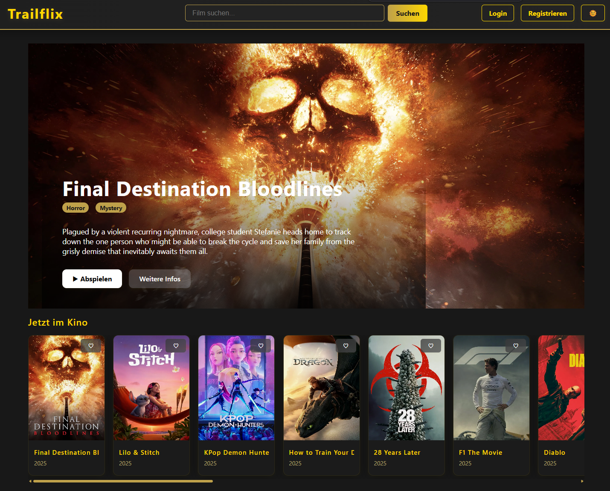
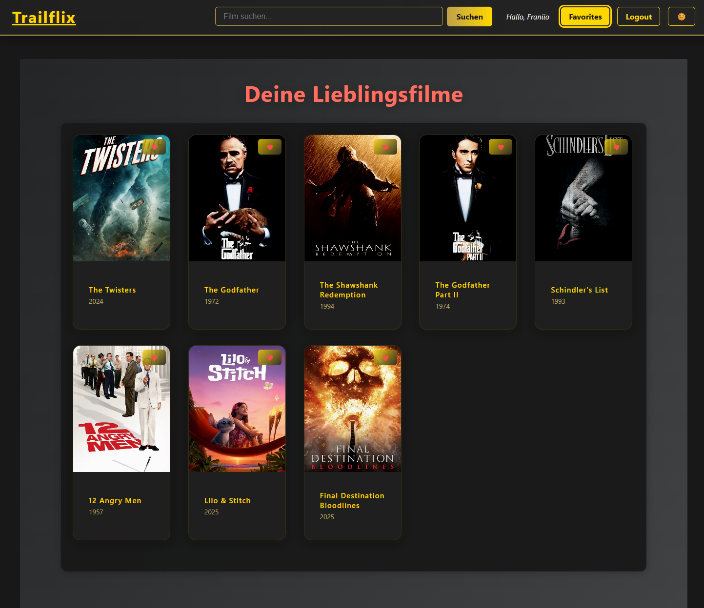

# 🎬 Trailflix – Film Streaming Plattform

## 1. Projektübersicht

**🎨 Projektname:**
Trailflix

**🛠️ Anwendungstyp:**
Clientseitige Streaming-Plattform (SPA)

**🧰 Technologie-Stack:**

- **Frontend:** React (Vite)
- **Backend:** Firebase (Auth, Firestore)
- **Styling:** CSS, variables-basiertes Theming (Dark/Light)
- **Datenquelle:** TMDB API (Filme, Trailer, Genres)

**🔍 Projektbeschreibung:**  
Trailflix ist eine moderne Streaming-Plattform, die es ermöglicht, Filme zu durchsuchen, Trailer abzuspielen und Favoriten zu speichern. Die App bietet Authentifizierung, Dark-/Light-Modus, Responsivität und eine performante Benutzeroberfläche.

---

## 2. Funktionen & Features

### 🎥 Startseite & Filme

- Hero-Sektion mit automatisch wechselnden Kinofilmen inkl. Trailer
- Anzeige von „Jetzt im Kino“, „Top bewertet“, „Beliebt“ und „Demnächst“ Filmen
- Horizontales Scrollen durch Filme
- Genre-Badges, Film-Bewertungen, Trailer & Details

### 🔎 Suche & Kategorien

- Live-Suche nach Filmtiteln (via TMDB API)
- Kategorien-Auswahl (per URL-Parametern)

### ⭐ Favoriten-System

- Nutzer können Filme zu Favoriten hinzufügen/entfernen
- Favoriten persistieren pro Nutzer (Firestore)
- „Favorites“-Seite mit Grid-Ansicht

### 🔐 Authentifizierung

- Registrierung mit E-Mail, Passwort & Nickname
- Live-Passwortvalidierung mit Feedback
- Login, Logout, Passwortanzeige/-zurücksetzung
- E-Mail-Verifikation (Firebase)
- Protected Routes (z. B. /favorites nur für eingeloggte Nutzer)

### 🌗 Dark-/Light-Mode

- Umschaltbar im Navbar
- Speicherung im `localStorage`

### 📱 Responsives Design

- Mobile-first umgesetzt
- Optimiert für Desktop, Tablet & Smartphone

---

## 3. Projektstruktur

```
src/
├── components/        # Wiederverwendbare Komponenten (NavBar, Footer, MovieCard...)
├── contexts/          # Theme-, Auth- & MovieContext (global state)
├── css/               # Styling (Hero, Footer, Global Styles...)
├── firebase/          # Firebase Konfiguration
├── pages/             # Seiten (Home, Login, Register, Favorites)
├── services/          # API-Zugriff auf TMDB & Firestore-Funktionen
└── App.jsx            # Hauptkomponente
```

---

## 4. Installation & Setup

### 🧱 Voraussetzungen

- Node.js ≥ 16
- Firebase-Projekt mit aktiviertem Auth & Firestore
- TMDB API Key (https://www.themoviedb.org)
- YouTube erlaubt als Videoquelle (keine eigene Speicherung)

### Schritt-für-Schritt:

```bash
git clone https://github.com/Fvdev-it/trailflix.git
cd trailflix
npm install
npm run dev
```

### 🔐 Firebase-Konfiguration (manuell anlegen)

`src/firebase/FirebaseConfig.js`:

```js
import { initializeApp } from "firebase/app";

const firebaseConfig = {
  apiKey: "DEIN_API_KEY",
  authDomain: "DEIN_AUTH_DOMAIN",
  projectId: "DEIN_PROJECT_ID",
  // ...
};

export const firebaseApp = initializeApp(firebaseConfig);
```

### 🌐 TMDB API-Konfiguration

- Trage deinen TMDB `API_KEY` und `BEARER_TOKEN` in `services/api.js` ein.

---

## 5. Technologie-Stack

| Bereich            | Technologie              | Beschreibung                       |
| ------------------ | ------------------------ | ---------------------------------- |
| Frontend           | React (Vite)             | Reaktive SPA mit Hooks und Context |
| Styling            | CSS                      | Variables, Media Queries           |
| Authentifizierung  | Firebase Auth            | Registrierung, Login, Verifikation |
| Datenbank          | Firestore                | Speichern der Favoriten pro Nutzer |
| API-Anbindung      | TMDB API                 | Filme, Genres, Trailer             |
| Hosting (optional) | Vercel, Firebase Hosting | Deployment-ready                   |

---

## 6. Sicherheit & Rollen

- Geschützte Routen via `PrivateRoute.jsx`
- Favoriten nur für eingeloggte Nutzer (UID-basiert in Firestore)
- Passwortvalidierung lokal mit Live-Feedback
- Firestore-Struktur: `userFavorites/{uid}`

---

## 7. Entwicklernotiz

- Die Datei Register.jsx ist vollständig kommentiert für Lernzwecke (UX, Validation, Firebase Handling).

- Andere Komponenten folgen demselben Muster – Kommentare wurden zur besseren Lesbarkeit reduziert.

---

## 8. Screenshots

Die vollständige Übersicht aller Screenshots befindet sich im Ordner [`/screenshots/`](./screenshots/).

### Vorschau:

#### 🏠 Startseite



#### ⭐ Favoritenübersicht



---

## 9. Lizenz

Dieses Projekt steht unter der Creative Commons BY-NC-ND 4.0 International Lizenz.

- ✅ Verwendung für persönliche Lern- und Portfoliozwecke ist erlaubt

- ❌ Kommerzielle Nutzung ist nicht gestattet

- ❌ Weiterverbreitung veränderter Versionen ist untersagt

- ℹ️ Namensnennung des Autors ist erforderlich

➡️ Lizenz: https://creativecommons.org/licenses/by-nc-nd/4.0/deed.de

---

## 10. Kontakt

- 📬 Entwickler: https://github.com/Fvdev-it
- 💼 Portfolio: https://fvdev.it

---

## 11. ToDos & Ausblick

✅ Trailer anzeigen  
✅ Favoriten speichern  
✅ Authentifizierung mit E-Mail  
🔜 Pagination / "Load more"-Funktion  
🔜 Benutzerprofilseite  
🔜 Internationale Lokalisierung (i18n)  
🔜 Watchlist mit Status (gesehen / geplant)it Tests (Jest), E2E Tests (Cypress)

---

## 12. Systemübersicht

```
[React Frontend] ⇆ [TMDB API]
        ⇅
[Firebase Auth] ⇆ [Firestore]
        ⇅
[Favoriten-Service]

```

- Authentifizierung über Firebase

- Filme & Trailer via TMDB API

- Favoriten individuell je Nutzer:in in Firestore

- State Management über Context API

## 13. Tests & Qualitätssicherung

🔍 Manuelle Tests:

- Responsives Verhalten (Desktop, Mobile)
- Login-/Logout-Flows
- Favoriten hinzufügen/entfernen
- Trailer-Vorschau & API-Anbindung

⚙️ Automatisierte Tests (vorbereitet)

- Setup mit Jest & React Testing Library möglich
- End-to-End: Cypress (optional vorbereitbar)

---

## 14. Deployment

- Bereit für Deployment via **Vercel**, **Netlify** oder Firebase Hosting
- Einfaches CI/CD-Setup via GitHub Actions optional möglich

---

## 15. React + Vite

This template provides a minimal setup to get React working in Vite with HMR and some ESLint rules.

Currently, two official plugins are available:

- [@vitejs/plugin-react](https://github.com/vitejs/vite-plugin-react/blob/main/packages/plugin-react) uses [Babel](https://babeljs.io/) for Fast Refresh
- [@vitejs/plugin-react-swc](https://github.com/vitejs/vite-plugin-react/blob/main/packages/plugin-react-swc) uses [SWC](https://swc.rs/) for Fast Refresh

## Expanding the ESLint configuration

If you are developing a production application, we recommend using TypeScript with type-aware lint rules enabled. Check out the [TS template](https://github.com/vitejs/vite/tree/main/packages/create-vite/template-react-ts) for information on how to integrate TypeScript and [`typescript-eslint`](https://typescript-eslint.io) in your project.
